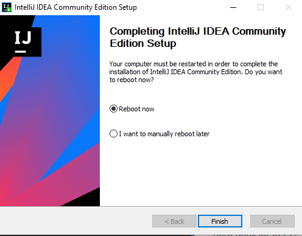

## Configuración de Entorno

Ahora vamos a configurar nuestro entorno de trabajo.

### Instalacion Java11

Para empezar instalaremos [JAVA 11](https://www.oracle.com/co/java/technologies/javase/jdk11-archive-downloads.html)(debemos tener en cuenta que para instalar el jdk nos pedirá estar registrado en oracle).

Al entrar a la pagina instalaremos el jdk según nuestro sistema operativo, en mi caso es Windows.

Le damos click en la parte azul y automáticamente empezara la instalación, la cual podremos ver el avance en la parte inferior izquierda.

Cuando se haya terminado la descarga le daremos click izquierdo y empezara la instalación en el pc.

Nos saldrá la siguiente pestaña y le daremos en next.

Avanzaremos y nos mostrara esta otra pestaña en la cual podremos cambiar la ruta donde queremos que se guarde el jdk(Change). Pero si no queremos cambiar la ruta simplemente le damos en next.

Es muy importante saber donde quedo instalado, ya que mas adelante necesitaremos la ruta.

Se iniciara la instalación y por ultimo nos saldrá esta pestaña en la cual le daremos close.

Ahora agregaremos el Java 11 a nuestro PATH.

Primero buscamos donde quedo instalado java, entramos a la carpeta bin y copiamos la ruta.

Ya copiada la ruta entramos en propiedades de nuestro equipo y clikeamos la opción 'Configuración avanzada del sistema'.

Cuando clikeamos esta opción nos saldrá la siguiente pestaña, la cual le daremos en 'variables de entorno'.

Al entrar a variables de entorno buscaremos en la parte superior la carpeta que diga Path y le damos click.

Nos abrirá otra pestaña en la cual el daremos nuevo y pegamos la ruta anteriormente copiada.

Para finalizar le damos en aceptar.
 

### Instalacion IntelliJ IDEA

Ahora instalaremos [ItelliJ IDEA](https://www.jetbrains.com/es-es/idea/download/#section=windows
). Cuando entremos a la pagina nos aparecerá dos opciones Ultimate(hay que pagar) y Community (es gratis).

Nosotros instalaremos la version Community, asi que clikeamos en descargar.

Al darle descargar nos mostrara en la parte inferior izquierda el progreso.

Cuando se haya terminado la descarga le daremos click izquierdo y empezara la instalación en el pc.

Nos saldrá la siguiente pestaña y le daremos en next.

Avanzaremos y nos mostrara esta otra pestaña en la cual podremos cambiar la ruta donde queremos que se guarde el IntellJ IDEA(Browse).

 Pero si no queremos cambiar la ruta simplemente le damos en next.

Ahora simplemente marcamos el campo para que IntelliJ IDEA quede en el Path y le damos en next.
 

Nos abrirá otra pestaña en la cual dejaremos JetBrains y le damos en Install.

 

Al finalizar la instalación te saldrá esta pestaña la cual es para reiniciar tu PC manualmente o de inmediato.

Recomiendo que lo reinicies de inmediato para que quede bien instalado  el IntelliJ IDEA.

Y listo!! Ya tu PC esta preparado para empezar a hacer proyectos.

